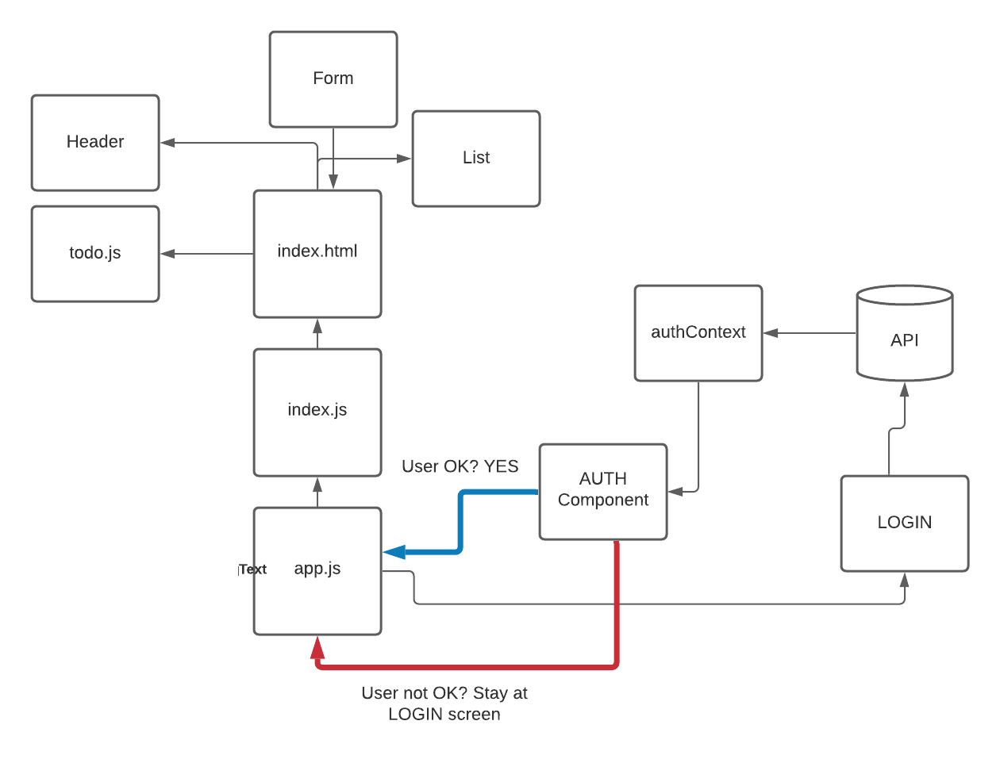

## TODO APP
To Do List Manager Phase 3: Adding security and access controls to the application.

In this final phase, we’ll be requiring that users be logged in, in order to see the to do items. Additionally, based on their user type, they will be allowed (or denied) to perform actions such as editing or deleting them.

PULL REQs:

https://github.com/yazanbaker94/todo-app/pull/1

TEST: 
To Do List Manager Phase 3: Adding security and access controls to the application.

In this final phase, we’ll be requiring that users be logged in, in order to see the to do items. Additionally, based on their user type, they will be allowed (or denied) to perform actions such as editing or deleting them.

DEPLOYED LINK:

https://csb-rkpur.netlify.app/

## UML Diagram:

