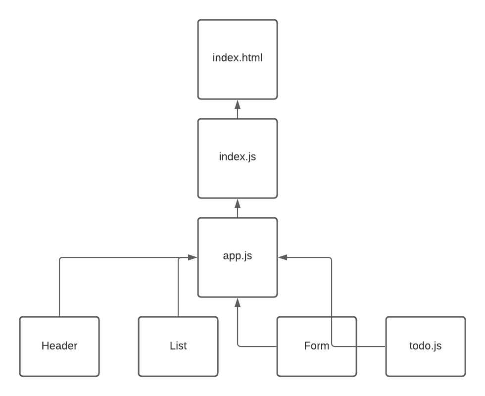

## TODO APP
To Do List Manager Phase 1: Incorporate configuration settings to the application

In this phase, we’ll be adding some top-level settings for the application, so that the user can make some display choices that the app will use by default.

PULL REQs:

https://github.com/yazanbaker94/todo-app/pull/1

TEST: 
To Do List Manager Phase 1: Incorporate configuration settings to the application

In this phase, we’ll be adding some top-level settings for the application, so that the user can make some display choices that the app will use by default.

## UML Diagram:

